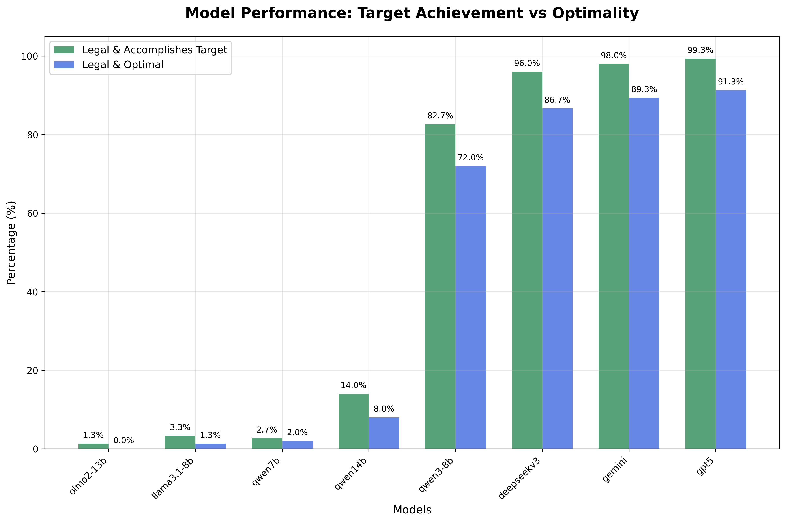
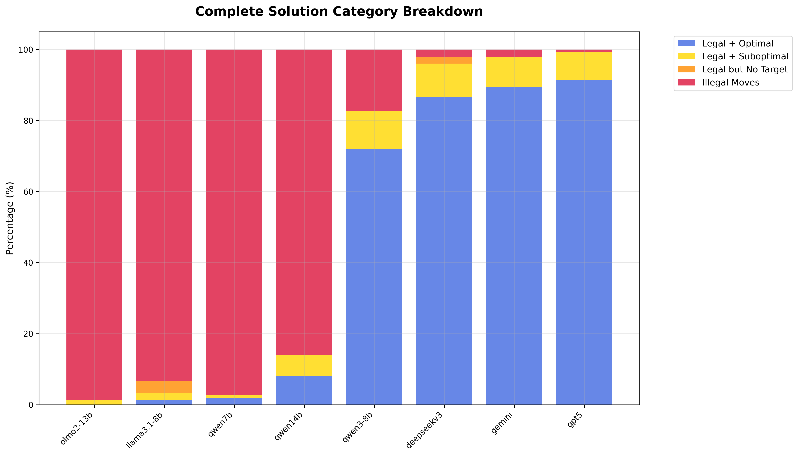
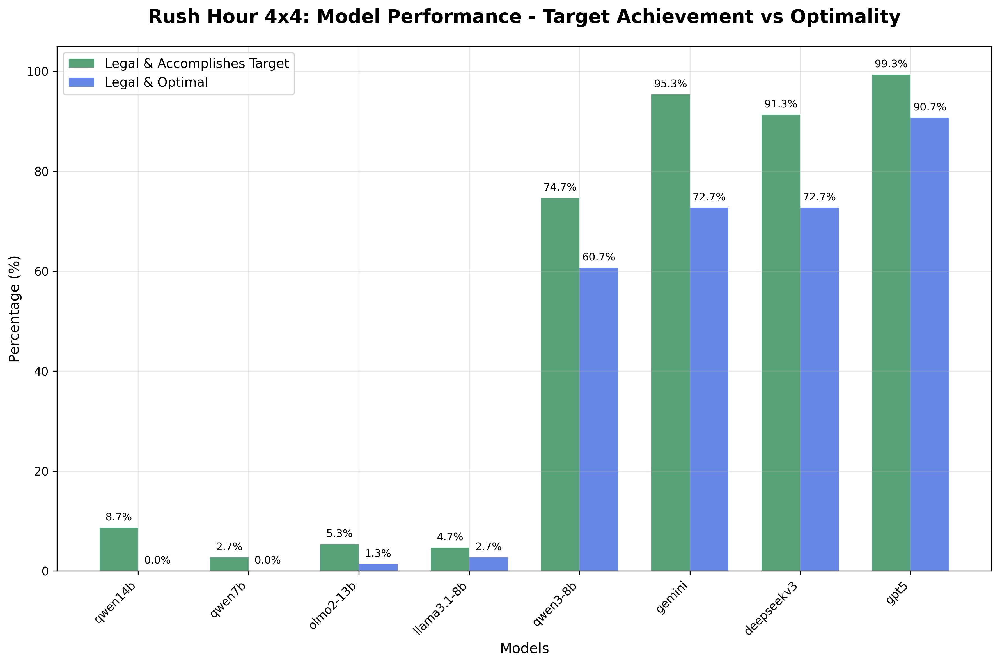
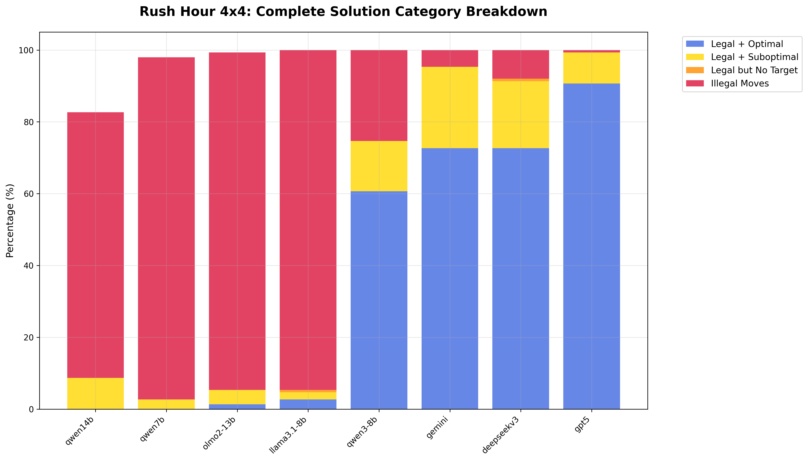
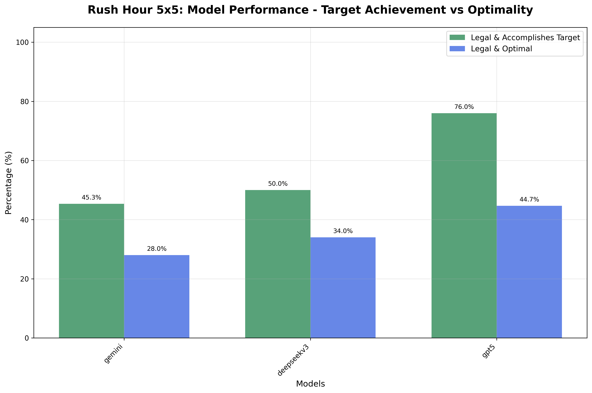
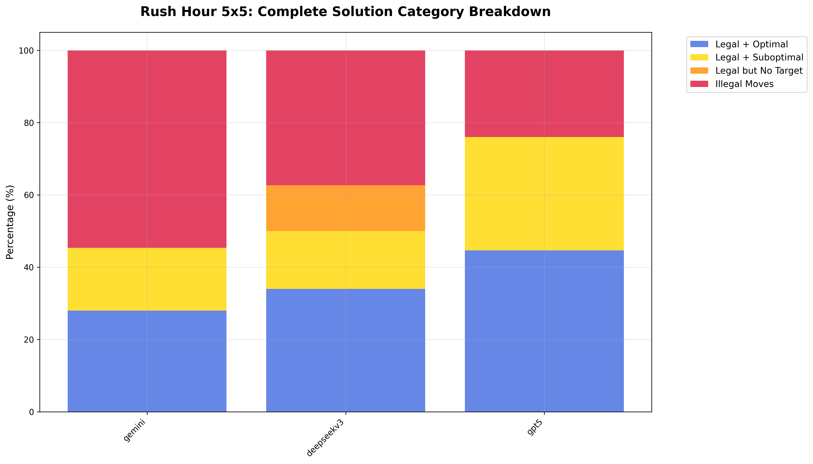
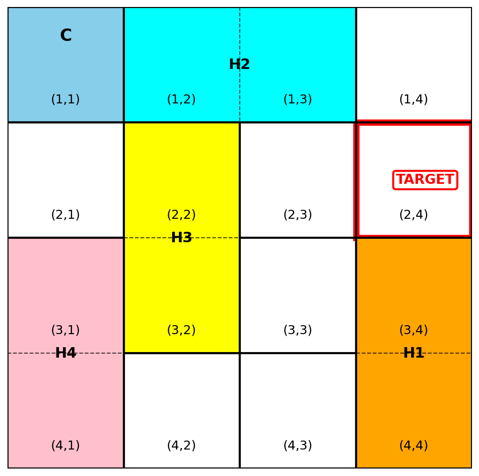

# Rush Hour Evaluation Framework

A comprehensive evaluation framework for testing the spatial reasoning ability of language models via 'Rush Hour' puzzle solving across different grid sizes (3x3, 4x4, 5x5). This has been benchmarked against SoTA models like GPT5-medium, Gemini-2.5 Pro and DeepseekV3-reasoner amongst other open-source models. Scroll down for benchmarked results and examples!

## Overview

This repository contains tools for generating, validating, and evaluating AI model performance on Rush Hour puzzles. It includes puzzle generators, solution validators, and evaluation results for various LLMs
## Repository Structure

```
├── data/                       # Puzzle datasets
│   ├── 3x3/                   # 3x3 puzzle data
│   ├── 4x4/                   # 4x4 puzzle data  
│   ├── 5x5/                   # 5x5 puzzle data
├── generators/                 # Puzzle generation notebooks
│   ├── generator3x3_final.ipynb
│   ├── generator4x4_final.ipynb
│   └── generator5x5_final.ipynb
├── models/                    # Model evaluation results & inference scripts (HuggingFace or API)
│   ├── claude/                
│   ├── gpt/                   
│   ├── gemini/                
│   ├── llama/                 
│   └── [other models]/
├── validators/                 # Solution validation tools
│   ├── solution_validator.py   # Core validation logic
│   ├── validator_*.py          # Grid-specific validators
│   ├── visualiser*.ipynb       # Puzzle visualization tools
│   └── *_validation_results.json
└── requirements.txt              # Python dependencies
```

## Features

### Puzzle Generation
- **Multi-size support**: Generate puzzles for 3x3, 4x4, and 5x5 grids
- **Difficulty levels**: Easy, medium, and hard puzzle configurations (number of blockers)
- **Uniqueness guarantee**: Ensures all generated puzzles are unique by block positions

### Validation System
- **Solution verification**: Validates puzzle solutions step-by-step
- **Format checking**: Ensures solutions follow the required format
- **Move validation**: Verifies that all moves are legal within game rules

### Model Evaluation
- **Multiple AI models**: Supports evaluation of various language models
- **Comprehensive metrics**: Tracks success rates, error types, and performance statistics
- **Visualization tools**: Jupyter notebooks for analyzing results and puzzle states

## Quick Start

1. Clone the repository:
```bash
git clone <repository-url>
cd rushhoureval
```

2. Install dependencies:
```bash
pip install -r requirements.txt
#Note: You will probably need a GPU to load and run inference using some of the open-source models
```

3. Model Inference
Add API key to a .env file or export it
```bash
cd models/[MODEL_NAME]
python [MODEL_NAME]_inference_[GRID_SIZE].py
```
4. Results Validation and Analysis
```bash
cd validators
# Adjust models you ran inference on in MODEL_NAMES list
python validator_[GRID_SIZE].py
```

## Usage

### Running Model Evaluation
The evaluation framework processes puzzles from the `data/[GRID_SIZE]/` directory, which contains 150 unique puzzles (50 easy, 50 medium, 50 hard)with:
- Initial puzzle state and final puzzle state (for human visualisation purpose only - prompts are text-based)
- JSON puzzle states
- Text prompts for models
- Reference solution

## Puzzle Format

Each puzzle consists of:
- **Grid state**: 2D array representing the puzzle board
- **Car position**: Current position of the car to be moved
- **Target position**: Goal position for the car
- **Pieces**: Dictionary of all puzzle pieces (car and blockers)
- **Difficulty metadata**: Puzzle complexity information

### Example Puzzle Structure
```json
{
  "grid": [["B2", ".", ".", "."], ...],
  "car_position": [4, 1],
  "exit_position": [2, 4],
  "pieces": {
    "C": {"type": "car", "position": [4, 1]},
    "B1": {"type": "1x1_blocker", "position": [3, 1]}
  },
  "puzzle_info": {
    "difficulty": "easy",
    "grid_size": "4x4",
    "total_moves_in_solution": 7
  }
}
```

## Results

### Benchmarks

Model results are categorised into 4 categories: 
 - Legal and Optimal (A legal solution was produced that matched the optimal number of moves)
 - Legal and Sub-Optimal (A legal solution was produced that had a sub-optimal number of moves)
 - Legal but no Target (A legal solution was produced that did not accomplish the target - moving car to target square(s))
 - Illegal move (Pieces overlapped, piece went out oof bounds etc.)

#### 3x3 Dataset Benchmark Results



#### 4x4 Dataset Benchmark Results



#### 5x5 Dataset Benchmark Results



## Coordinate System

- **Format**: `[row, col]` where `[1,1]` is top-left
- **Grid bounds**: `[1,1]` to `[N,N]` for NxN grids
- **Movement**: UP, DOWN, LEFT, RIGHT by one square

## Example


```bash
# Text Prompt to LLM 
Task: You have been given a 4x4 Rush Hour puzzle above which you need to solve. Move car "C" from position [1,1] to the TARGET at position [2,4].

Current Pieces:
- Car "C": Position [1,1]
- 1x1 Blockers: None
- 2x1 Blockers: H2 (horizontal) at [1,2], [1,3], H3 (vertical) at [2,2], [3,2], H4 (vertical) at [3,1], [4,1], H1 (vertical) at [3,4], [4,4]
- TARGET: Position [2,4]

Rules:
- Any piece can move UP, DOWN, LEFT, or RIGHT by exactly one square
- For 2x1 blockers: The entire piece moves together as a unit
- Pieces cannot move outside the 4x4 grid
- Pieces cannot move into occupied squares
- No two pieces can occupy the same square
- Goal: Move car "C" to the TARGET position

Coordinate System: [row,col] format where [1,1] is top-left, [4,4] is bottom-right

Provide your solution as:
<solution>
Step 1: [PIECE] [start_position] -> [end_position]
Step 2: [PIECE] [start_position] -> [end_position]
...
</solution>

For 1x1 pieces (car "C" and blockers "B1", "B2", etc.):
- Use single coordinate: C [2,1] -> [2,2]

For 2x1 pieces (blockers "H1", "H2", etc.):
- List both coordinates: H1 [[1,1],[1,2]] -> [[2,1],[2,2]]

Example response format:
<solution>
Step 1: C [2,1] -> [2,2]
Step 2: H1 [[1,3],[1,4]] -> [[2,3],[2,4]]  
Step 3: B1 [3,2] -> [3,1]
Step 4: C [2,2] -> [2,4]
</solution>
```
**Solution Provided by Gemini2.5 Pro on Dynamic Thinking:**

Raw Response:

`An optimal solution requires clearing a path for car 'C' to move from row 2 to the TARGET on row 3. This involves a sequence of moves to shift the blocking pieces, primarily `B1`, `L1`, and the key vertical blocker `L4`.\n\nThe strategy is as follows:\n1.  Move the horizontal blocker `L2` at the bottom to the right. This creates space in row 5.\n2.  Move the vertical blocker `B2` down into the newly created space. This clears space in row 3.\n3.  Move the main vertical blocker `L4` down. This is the crucial move that unlocks the horizontal pieces above it.\n4.  With `L4` shifted down, `L1` can now slide left.\n5.  With `L1` out of the way, `B1` (which is in the TARGET zone) can be moved left, clearing the path for 'C'.\n6.  Finally, move car 'C' down and then right into the now-empty TARGET zone.\n\nHere is the step-by-step optimal sequence of moves:\n\n<solution>\nStep 1: L2 [[5,1],[5,2],[5,3]] -> [[5,2],[5,3],[5,4]]\nStep 2: L2 [[5,2],[5,3],[5,4]] -> [[5,3],[5,4],[5,5]]\nStep 3: B2 [[3,1],[4,1]] -> [[4,1],[5,1]]\nStep 4: L4 [[2,2],[3,2],[4,2]] -> [[3,2],[4,2],[5,2]]\nStep 5: L1 [[4,3],[4,4],[4,5]] -> [[4,2],[4,3],[4,4]]\nStep 6: B1 [[3,4],[3,5]] -> [[3,3],[3,4]]\nStep 7: B1 [[3,3],[3,4]] -> [[3,2],[3,3]]\nStep 8: C [[2,3],[2,4]] -> [[3,3],[3,4]]\nStep 9: C [[3,3],[3,4]] -> [[3,4],[3,5]]\n</solution>`

Parsed Solution:

```bash
    "Step 1: L2 [[5,1],[5,2],[5,3]] -> [[5,2],[5,3],[5,4]]",
    "Step 2: L2 [[5,2],[5,3],[5,4]] -> [[5,3],[5,4],[5,5]]",
    "Step 3: B2 [[3,1],[4,1]] -> [[4,1],[5,1]]",
    "Step 4: L4 [[2,2],[3,2],[4,2]] -> [[3,2],[4,2],[5,2]]",
    "Step 5: L1 [[4,3],[4,4],[4,5]] -> [[4,2],[4,3],[4,4]]",
    "Step 6: B1 [[3,4],[3,5]] -> [[3,3],[3,4]]",
    "Step 7: B1 [[3,3],[3,4]] -> [[3,2],[3,3]]",
    "Step 8: C [[2,3],[2,4]] -> [[3,3],[3,4]]",
    "Step 9: C [[3,3],[3,4]] -> [[3,4],[3,5]]"
```
 